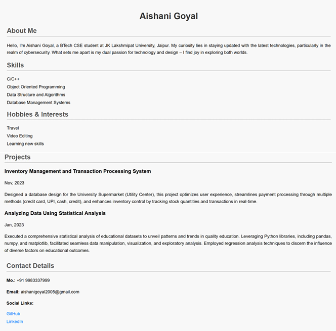
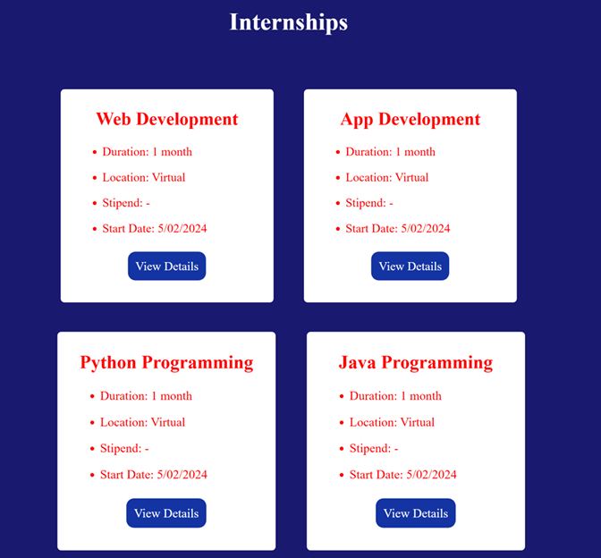
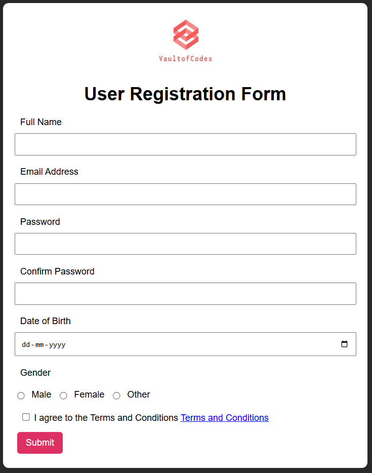

# 🌐 VaultOfCodes Tasks

Welcome to the **VaultOfCodes Tasks** repository!  
This repo showcases the projects I completed during my **Virtual Training cum Internship Program** with [Vault of Codes](https://www.vaultofcodes.in/), where I explored and practiced the **fundamentals of web development** using **HTML, CSS, and JavaScript**.

---

## 🚀 What I Learned

During this internship, I gained hands-on experience with:

- 🧱 Structuring web pages using **HTML5**
- 🎨 Styling with **CSS3** for responsive and attractive layouts
- ⚙️ Adding interactivity using **JavaScript**
- 🛠️ Building real-world web components and pages

---

## 📁 Tasks Completed

### 🔹 1. **Personal Portfolio Web Page**
> A simple yet elegant personal portfolio page to showcase my skills, projects, and contact information.

**Key Features:**
- Clean layout with sections like About, Skills, Projects, and Contact
- Responsive design using CSS Flexbox and Media Queries
- Smooth scrolling and navigation bar

---

### 🔹 2. **Vault of Codes - Internship Page Recreation**
> Recreated the official Internship Page of Vault of Codes using only HTML, CSS, and JavaScript.

**Key Features:**
- Matching the original design as closely as possible
- Custom layout components for header, cards, and buttons
- Applied hover effects and transitions for a modern look

---

### 🔹 3. **User Registration Form**
> A registration form that includes input validation using JavaScript.

**Key Features:**
- HTML form elements with labels and placeholders
- Real-time client-side validation (e.g., email, password confirmation)
- User-friendly and accessible design

---

### 📸 Screenshots

#### 🖼️ Portfolio Web Page

#### 🖼️ Internship Page Recreation

#### 🖼️ User Registration Form

---

## 🛠️ Tools & Technologies Used

- HTML5 - Base structure of all tasks
- Internal CSS – Styling done within <style> tags inside HTML files
- Internal JavaScript – Functionality implemented using <script> tags directly in the HTML

---

## 📝 Conclusion

This internship provided me with a solid foundation in web development. Each task helped me strengthen my understanding of frontend technologies and best practices in UI/UX design.  
It was a great opportunity to learn by doing, and this repository stands as proof of my growth throughout the program.

